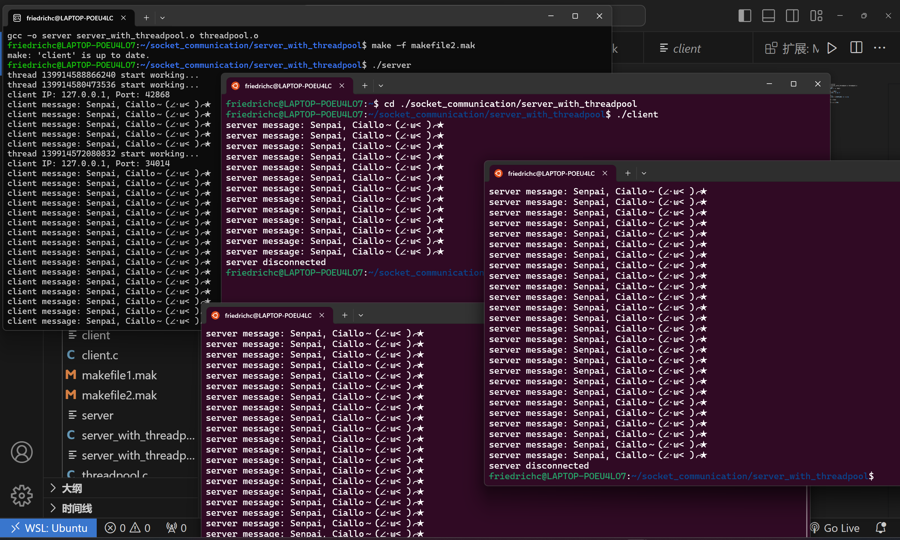
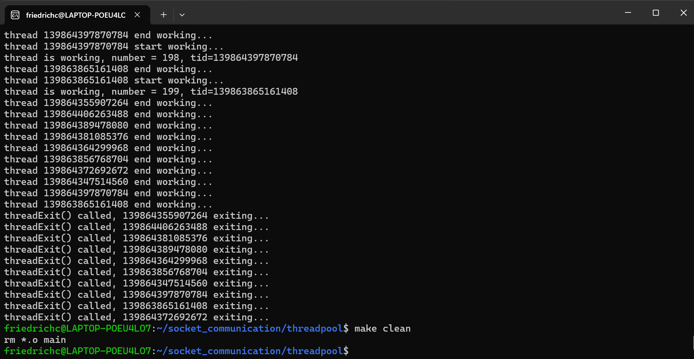

# CS-HARD-02 Network Programming

半成品，真不够时间学了，目前仅实现了 Part1 的服务器客户端通信以及线程池，服务器仅仅是一个普通回声服务器，原样输出客户端发送的内容，其他的功能还没有 (o;TωT)o

#### 说明

`code` 文件夹下的 `echo_server` 文件夹包含单线程的普通服务器 `server.c`、手动管理多线程的版本 `serverMultiThread.c` 。

`server_with_threadpool` 文件夹内的是应用的线程池的版本的服务器。

`threadpool` 文件夹用于测试线程池效果。

#### 运行结果

线程池版本的服务器的测试（非线程池版本运行结果相同）：

线程池测试：

线程创建退出销毁基本都正常。

能打多少分就打多少分吧，毕竟一个 Part 都没完成，随便打点就好了 Σ(ＴωＴ) 